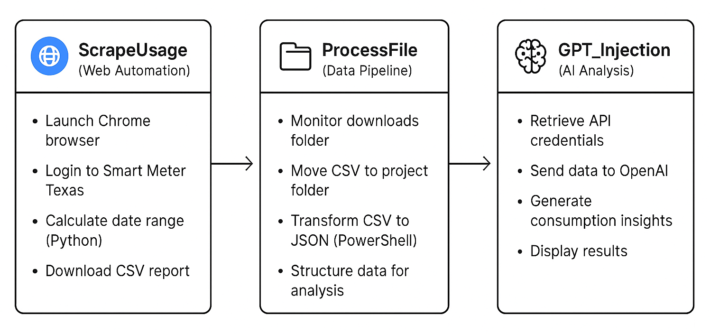

# Texas Smart Meter Scraper

An automated Power Automate Desktop solution that collects and analyzes monthly electricity usage data from Smart Meter Texas. The project demonstrates RPA capabilities combined with data processing and AI-powered analytics.

## Technical Stack

- **VMware Workstation** - Isolated virtual environment for secure automation
- **Power Automate Desktop** - Orchestration and UI automation
- **Python** - Dynamic date calculations
- **PowerShell** - Data transformation and API integration
- **OpenAI API** - Consumption pattern analysis
- **Chrome WebDriver** - Browser automation

## Key Features

- **Isolated Execution**: Runs in VMware virtual machine for security and portability
- **Dynamic Date Handling**: Automatically calculates rolling 30-day windows
- **Error Resilience**: Built-in waits and file existence checks
- **Secure Credential Management**: Environment variable storage for API keys
- **Modular Design**: Reusable subflows for maintainability
- **Data Pipeline**: CSV to JSON transformation with field mapping

---

> **Flow Architecture**  
> See the Power Automate Desktop flow structure with three modular subflows working together:

****
*Main orchestration flow showing ScrapeUsage, ProcessFile, and GPT_Injection subflows*

---

## Overview

This automation runs monthly to:
- Authenticate and navigate the Smart Meter Texas web portal
- Download the last 30 days of electricity usage data
- Process the raw CSV data into structured JSON format
- Generate insights using OpenAI's GPT model

## Architecture

The solution consists of three modular subflows:

****
<!-- PLACEHOLDER: Screenshot of PAD showing the main flow with three subflows listed
Show the flow designer with ScrapeUsage, ProcessFile, and GPT_Injection visible -->

### ScrapeUsage
Handles web automation using Chrome to:
- Authenticate with stored credentials
- Navigate to the reporting section
- Configure date ranges dynamically using Python
- Export usage data as CSV

****
<!-- PLACEHOLDER: 15-20 second GIF showing:
- Browser launching and navigating to Smart Meter Texas
- Automated login (with credentials blurred)
- Date selection using Python calculations
- Report generation and download
-->

*The flow uses Python scripts to calculate dynamic date ranges and Chrome automation for reliable data extraction*

### ProcessFile
Manages data pipeline operations:
- Monitors download completion
- Relocates files to project directory
- Transforms CSV to JSON using PowerShell
- Structures data for analysis (Date, Usage KWH, Meter Readings)

**PowerShell Script Used:**
```powershell
$folderPath = "C:\Projects\Texas Smart Meter Reports"
$latestFile = Get-ChildItem -Path $folderPath -Filter "*.csv" | Sort-Object LastWriteTime -Descending | Select-Object -First 1

if ($latestFile) {
    $csvData = Import-Csv -Path $latestFile.FullName
    
    # Create simplified objects with just date and usage
    $simplifiedData = $csvData | ForEach-Object {
        [PSCustomObject]@{
            Date = $_.USAGE_DATE
            DailyUsageKWH = $_.USAGE_KWH
            StartReading = $_.START_READING
            EndReading = $_.END_READING
        }
    }
    
    $jsonOutput = $simplifiedData | ConvertTo-Json -Depth 10
    Write-Output $jsonOutput
} else {
    Write-Output "ERROR: No CSV files found"
}
```

****
<!-- PLACEHOLDER: 10-15 second GIF showing:
- File appearing in downloads folder
- File being moved to project directory
- PowerShell window executing transformation
- JSON output being generated
-->

*The PowerShell script automatically finds the newest CSV file and transforms it into structured JSON format for analysis*

### GPT_Injection
Integrates with OpenAI API to:
- Retrieve API credentials from environment variables
- Construct analysis prompts with usage data
- Generate comprehensive consumption insights
- Display analysis results

**PowerShell Script for OpenAI Analysis:**
```powershell
# Get API Key from environment
$apiKey = [System.Environment]::GetEnvironmentVariable("OPENAI_API_KEY", "User")

# Get the most recent CSV file
$folderPath = "C:\Projects\Texas Smart Meter Reports"
$latestFile = Get-ChildItem -Path $folderPath -Filter "*.csv" | Sort-Object LastWriteTime -Descending | Select-Object -First 1

if ($latestFile) {
    # Read and process CSV
    $csvData = Import-Csv -Path $latestFile.FullName
    
    # Create simplified data
    $simplifiedData = $csvData | ForEach-Object {
        [PSCustomObject]@{
            Date = $_.USAGE_DATE
            DailyUsageKWH = $_.USAGE_KWH
        }
    }
    
    # Convert to JSON string
    $dataJson = $simplifiedData | ConvertTo-Json -Depth 10
    
    # Create the complete request
    $headers = @{
        "Content-Type" = "application/json"
        "Authorization" = "Bearer $apiKey"
    }
    
    $body = @{
        model = "gpt-3.5-turbo"
        messages = @(
            @{
                role = "system"
                content = "You are an energy consumption analyst. Analyze the electricity usage data provided and give insights on: 1) Total usage and daily average, 2) Peak usage days and potential reasons, 3) Usage patterns (weekday vs weekend), 4) Cost-saving recommendations, 5) Any unusual consumption patterns."
            },
            @{
                role = "user"
                content = "Here is my 30-day electricity usage data: $dataJson"
            }
        )
        temperature = 0.7
        max_tokens = 1500
    } | ConvertTo-Json -Depth 10
    
    # Make the API call
    try {
        $response = Invoke-RestMethod -Uri "https://api.openai.com/v1/chat/completions" -Headers $headers -Method Post -Body $body
        
        # Extract just the analysis text
        $analysis = $response.choices[0].message.content
        Write-Output $analysis
    }
    catch {
        Write-Output "ERROR: API call failed - $_"
    }
} else {
    Write-Output "ERROR: No CSV files found"
}
```

****
<!-- PLACEHOLDER: Screenshot of the PAD message box showing GPT analysis results
Should show usage summary, patterns, and recommendations -->

## Data Analysis Capabilities

The system analyzes:
- Total usage and daily averages
- Peak consumption identification
- Weekday vs weekend patterns
- Cost optimization opportunities
- Anomaly detection in usage patterns

## Implementation Highlights

- Leverages browser automation for sites without APIs
- Combines multiple scripting languages for optimal task handling
- Implements proper file management and data transformation
- Integrates modern AI capabilities for actionable insights

## Project Structure

```
Texas-Smart-Meter-Scraper/
├── README.md                    # Project overview
├── scripts/
│   ├── calculate_dates.py     # Date range calculation logic
│   ├── csv_to_json.ps1       # CSV transformation script
│   └── gpt_analysis.ps1      # OpenAI API integration
├── images/
│   └── [project visuals]      # GIFs and screenshots
├── .gitignore
└── LICENSE
```

### Directory Guide

- **`scripts/`** - Standalone PowerShell and Python scripts used in the automation
- **`images/`** - Visual documentation and demos